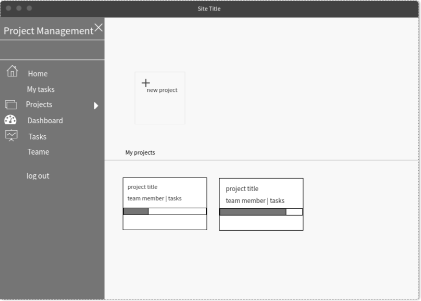

# Project Managment
Project management software is a centralized hub for your work, task management and project planning. 
It allows you to keep an accurate project schedule and delegate tasks to the right people.

## User story
- As a User, I should be able to create account
- As a User, I should be able to log in
- As a User, I should be able to log out
- As a User, I should be able to see my own task
- As a Manager, I should be able to create a new project
- As a Manager, I should be able to add a team member to an exsisting project
- As a Manager, I should be able to add new tasks to specific member
- As a Manager, I should be able to delete any task to an exsisting project
- As a Manager, I should be able to update any task in an exsisting project
- As a Manager, I should be able to delete all tasks from a project
- As a Manager, I should be able to delete all tasks for a spicific member
- As a Manager, I should be able to remove specific member from a project
- As a Manager, I should be able to assign the task to a different memebr
- As a Manager, I should be able to see project details consisting of : team members and their tasks

## wireframe

## ERD

### Technologies
- ReactJs
- JavaScript 
- Html
- Css
- Express
- MongoDb
- Bootstrap
- Node

## API Endpoints
These are some of the EndPoints we used in this project

| #  |  Action  |  Method |  URL  |  Description  |
| :------------ | :------------ | :------------ | :------------ | :------------ |
|  1|  create |post  |   /login |  to check if user there to allow the user to log in|
|   2|  create | post  |/signUp   | To create new account|
|   3|   create |post  |/project/new   | To create new project |
|   4|   Add | patch  | /members/new/:id  |To Add a new member to the project |
|   5|   delete | delete  |  /project/:id | To delete a project|
|   6|   Remove |patch   |/members/remove/:id   | To remove a member from a project|
|   7|    Update|patch   |/project/:id   |To edit(add/delete tasks) the project |

## Feature Work
- dashborad to follow up on workflow
- User get alert when any update related to the user tasks
## Installation and Setup Instructions
Clone down this repository. You will need `node` and `npm` installed globally on your machine.

#### Installation
`npm install`

#### To Start Mongoose Server inside back-end folder
`npm start`

#### To Start Server inside front-end folder
`npm start`

Now, you can visit the Project-Managment website on `https://localhost:3000/`.Also, you can visit the mngoose server on `https://localhost:5000/`.

